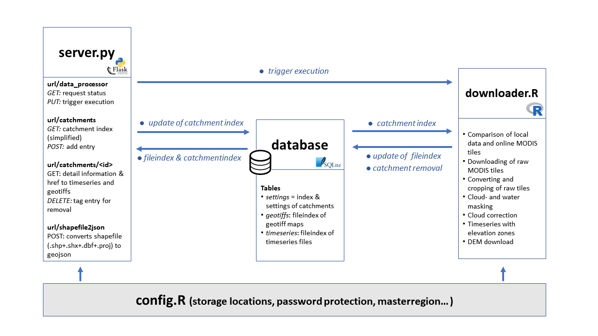


# modis-snow-server

## Introduction

The MODIS Satellites Terra and Aqua generate each one optical satellite image per day of almost every spot on earth. The MODIS Snow Cover Product (MOD10A1 and MYD10A1) allows to monitor the extent of the snow covered surface. Such an information can be used e.g. to produce seasonal forecasts for river runoff in catchments, where snow is the main contributor to the volume.

This repository contains the builidng blocks for a data server, that automatically updates the local record of data with recent MODIS observations and provides an API from which specific datasets can be retrieved.
An operational server (http://52.48.91.250/) based on this repository has been deployed within a project aiming to modernize the Hydromet Services in Central Asia, lead by hydrosolutions Ltd.

## Overview
The complete server consists of four parts: downloader, server, database and configuration. 
#### Downloader
 It compares the local data record with the record of MODIS data that are available online. If the local data record needs to be updated, it downloads the required raw MODIS tiles for the selected region. The new tiles are processed (converted, cropped, mosaiced, combined (Terra&Aqua)) to produce one daily geotiff image of the selected region. Additional steps include a simple cloud correction algorithm (use prior observation principle) and the computation of timeseries for the whole region or seperate for each elevation zone. Finally, the new data is registered in the database and temporary files are deleted. 
 The code is written in R and makes use of various libraries for spatial data like rgdal, MODIS, elevatr etc.
 
#### Server
The server provides the API for data access to the data end user. It reads the record of data that are registered in the database and organises them. Apart from providing access to the data, the server offers an API to create or delete regions. The minimum requirement for the creation of a new region is a single polygon shape in geojson format and an arbitrary name. The server can also trigger the execution of the downloader
The server application is build with the python flask library and can e.g. be deployed with gunicorn, nginx and supervisor.
More information: [Server API](server_api/Readme.md)

#### Database
This is where the downloader and the server interact which each other. On the one side, the server alters the index of catchments and their properties. Those information are then read by the downloader, which accordingly generates the requested data. The downloader updates the fileindex of the database. This fileindex is read by the server to get an overview of the available data. The database is created on the first execution of the downloader in case no database file exists yet. SQLite is used for the database.
More information: [Database](database/Readme.md)
 
#### Configuration
The file config.R contains some essential, static settings like storage locations, password protection fo the server API and so on. It is read by both the downloader and server.
More information: [Config.R](configuration/Readme.md)

